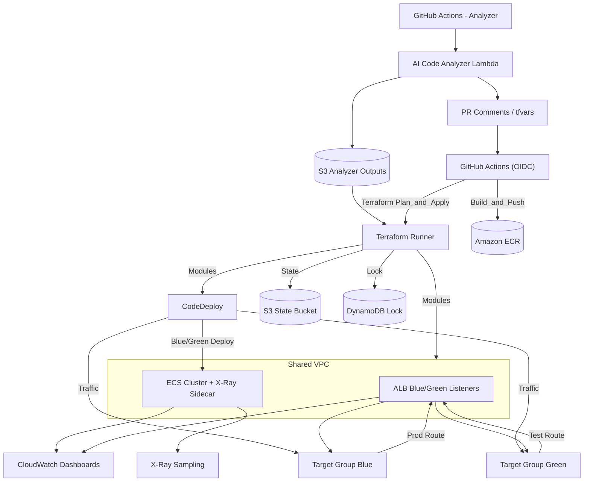

# Deployment system

## Core Design Points

- **GitHub → AWS Authentication**: Use GitHub OIDC with an AWS IAM role (web identity) to mint short-lived credentials. In workflows, use `aws-actions/configure-aws-credentials`. Keep long-lived secrets to a minimum.
- **Image Tag Propagation**: GitHub Actions pushes the image to ECR tagged with `<commit_sha>`. The Terraform CLI deploy step passes this value via `-var="image_tag=<commit_sha>"`, updating the ECS Task Definition.
- **Infrastructure as Source**: Place Terraform modules under the repo’s `infrastructure/` directory. Use **Terraform CLI with a remote backend (S3 state + DynamoDB locking)** from GitHub Actions. Keep environment-specific settings (subnets, DB size, etc.) separated by variable files or workspace directories.
- **AI Analyzer Integration**: A Lambda “AI Code Analyzer” scans `.delightful.yaml` and the codebase to infer **expected traffic, scale, cache presence, DB flavor, health check path**, etc., then:
    1. posts recommendations as PR comments,
    2. writes `generated/terraform.tfvars.json` to S3, and
    3. optionally emits sample modules under `infrastructure/` for human review and merge.
- **Rollback Strategy**:
    - With CodeDeploy: automatic rollback on deployment failure.
    - Without CodeDeploy: from GitHub Actions, re-apply the previous known-good tag by running `terraform apply -var=image_tag=<previous>` with the remote backend unlocked for an immediate revert.
- **Observability**: Use Terraform to provision **dashboards, alarms, log group retention, and X-Ray sampling**. In a post-deploy step, GitHub Actions posts the **dashboard URL** and latest deployment link to PR comments and Slack.

## Architecture Diagram (ASCII)

```
┌───────────────────────────────────────────────────────────────────────────┐
│                              Developer                                    │
│                           (write code & push)                             │
└───────────────────────────────────────────────────────────────────────────┘
                                      │
                                      ▼
                   ┌────────────────────────────────────┐
                   │         GitHub Repository          │
                   │     (includes .delightful.yaml)    │
                   └────────────────────────────────────┘
                                      │
                                      ▼
             ┌──────────────────────────────────────────────────────┐
             │                   GitHub Actions                     │
             │------------------------------------------------------│
             │ 1) Analyzer Workflow                                 │
             │    - Invoke Lambda (AI Code Analyzer)                │
             │    - Analyze lang/deps/traffic                       │
             │    - PR comments & tfvars suggestions                │
             │                                                      │
             │ 2) CI/CD Workflow                                    │
             │    - Build / Test / SCA                              │
             │    - Push image to ECR                               │
             │    - Terraform Apply (CLI, passes image_tag)         │
             │    - Trigger CodeDeploy Blue/Green                   │
             │    - Smoke tests & Slack notifications               │
             └──────────────────────────────────────────────────────┘
                                      │
                                      ▼
                   ┌────────────────────────────────┐
                   │   Terraform Pipeline (CLI)     │
                   │ - Remote state (S3/Dynamo)     │
                   │ - Applies ECS / CodeDeploy     │
                   │ - Configures CloudWatch/X-Ray  │
                   └────────────────────────────────┘
                                      │
                                      ▼
┌───────────────────────────────────────────────────────────────────────────┐
│                                   AWS                                     │
│---------------------------------------------------------------------------│
│   ┌──────────────┐     ┌──────────────┐     ┌─────────────────┐           │
│   │     ECS      │◄───►│     ALB      │◄───►│    CodeDeploy   │◄──┐       │
│   │ (TaskDef: TF)│     │ (Blue/Green) │     │(deploy/rollback)│   │       │
│   └──────────────┘     └──────────────┘     └─────────────────┘   │       │
│          ▲                                           │            │       │
│          │                                           │            │       │
│   ┌──────────────┐     ┌──────────────┐     ┌──────────────┐      │       │
│   │     RDS      │     │  ElastiCache │     │  CloudWatch  │  ◄───┘       │
│   │     (DB)     │     │    (Redis)   │     │    + X-Ray   │              │
│   └──────────────┘     └──────────────┘     └──────────────┘              │
└───────────────────────────────────────────────────────────────────────────┘
                                      │
                                      ▼
                     ┌───────────────────────────┐
                     │  Slack / Dashboard Links  │
                     │ (deploy results & metrics)│
                     └───────────────────────────┘

```

## Summary Matrix

| Layer | Components | Role |
| --- | --- | --- |
| **Developer Layer** | GitHub Repo | Push code and open PRs |
| **Automation Layer** | GitHub Actions | Build/test/deploy automation; triggers AI Analyzer Lambda |
| **Infrastructure Layer** | Terraform Pipeline (CLI + Remote State) | Manages infra and CodeDeploy configuration |
| **AWS Execution Layer** | ECS + ALB + CodeDeploy + CloudWatch | Runs the service, enables Blue/Green + rollback, and monitoring |
| **Analysis Layer** | AI Code Analyzer (Lambda) | Code-driven AI analysis and deployment setting suggestions |

## Network & Deployment Flow (Mermaid)


